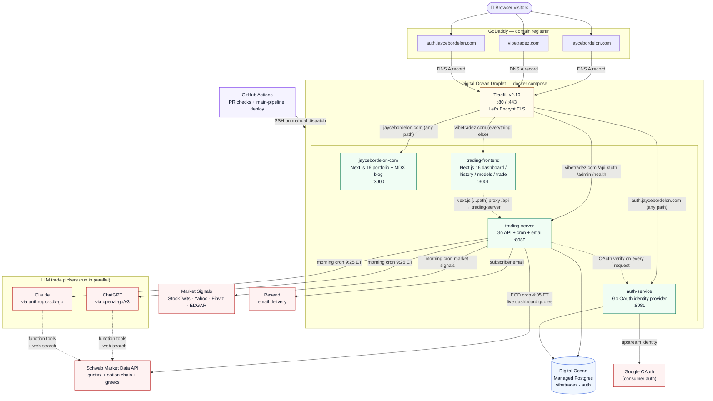
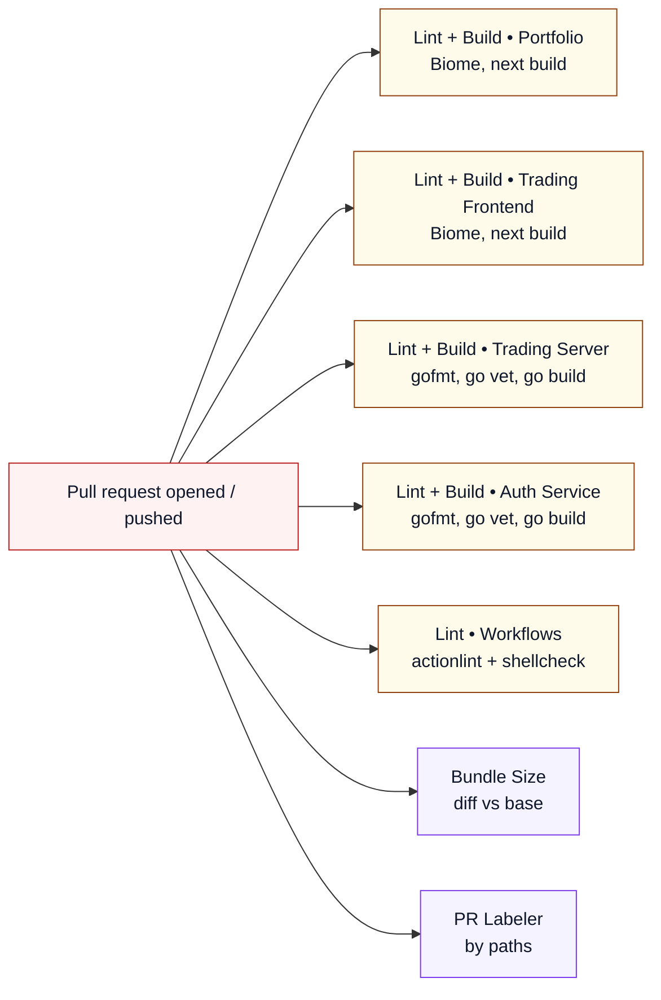
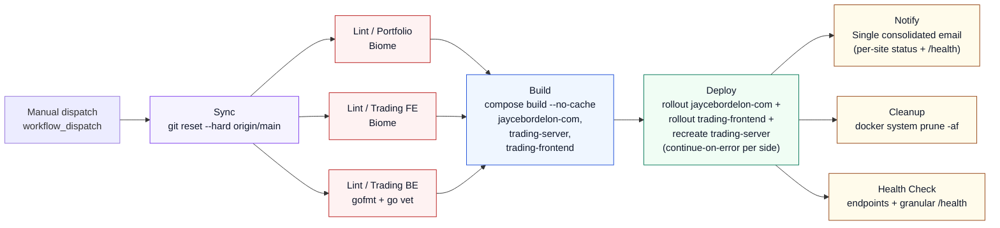

# jaycestuff

Jayce Bordelon's production monorepo. Three public services and the infrastructure that runs them, all deployed to a single Digital Ocean droplet behind Traefik.

## Architecture



**Reading the diagram:** users hit GoDaddy DNS, which points at the droplet. Traefik terminates TLS (Let's Encrypt) and routes by hostname + path priority to one of four containers. The trading server talks to Postgres for persistence, Schwab for market data, ChatGPT **and** Claude in parallel for the dual-model picker, four sentiment sources, and Resend for email. The auth service brokers Google OAuth and verifies tokens for the trading server on every request. GitHub Actions deploys via SSH against the same `docker-compose.yml` that defines the stack.

## What's in here

```
jaycestuff/
├── jaycebordelon.com/      Personal portfolio + blog (Next.js 16, MDX, Framer Motion)
├── auth.jaycebordelon.com/ Centralized OAuth identity provider (Go 1.25, Postgres)
├── vibetradez.com/         Options trading service
│   ├── server/             Go API (cron jobs, dual-model LLM picking, Schwab market data, Resend email)
│   ├── client/             Next.js 16 dashboard (live picks, history, model comparison, /trade/[symbol])
│   └── local/              Self-contained Docker stack with seeded Postgres for offline dev
├── scripts/
│   └── ux-audit/           Puppeteer UX audit harness (light + dark, desktop + mobile)
├── .github/workflows/      CI/CD pipelines (pr-checks for PRs, main-pipeline for deploy)
├── docker-compose.yml      Production stack: Traefik + portfolio + auth + trading server + trading frontend
└── CLAUDE.md               Project conventions, dev rules, dual-model architecture
```

## Hostnames, containers, routes

| Hostname | Container | Port | Routes |
|---|---|---|---|
| `jaycebordelon.com` / `www.jaycebordelon.com` | `jaycebordelon-com` | 3000 | All paths (Next.js portfolio) |
| `auth.jaycebordelon.com` | `auth-service` | 8081 | All paths — OAuth identity provider |
| `vibetradez.com` / `www.vibetradez.com` | `trading-server` | 8080 | `/api/*`, `/auth/*`, `/admin/*`, `/health` (priority 20) |
| `vibetradez.com` / `www.vibetradez.com` | `trading-frontend` | 3001 | Everything else (priority 10, Next.js trading UI) |
| `jayceb.com` / `www.jayceb.com` | — | — | 301 redirect to `jaycebordelon.com` |

Traefik routes by hostname + path priority. The legacy `jayceb.com` portfolio domain is kept around as a permanent redirect so existing links don't break.

## Trading service highlights

- **Dual-model independent picking.** Every weekday morning the Go cron sends the same `AnalysisPrompt` to both ChatGPT (via `openai-go/v3`) **and** Claude (via `anthropic-sdk-go`) in parallel. Each model independently runs the workflow with the same Schwab market data toolset and built-in web search, and each produces its own ranked top 10 picks. Neither model sees the other's output. The cron then unions both pick sets — consensus picks (where both models picked the same ticker) carry both scores and tie-break ahead of single-model picks.
- **`/models` head-to-head page.** Side-by-side ChatGPT vs Claude backtest with cumulative P&L curve, agreement rate, best/worst pick per model, and a configurable date range. Backed by `GET /api/model-comparison?range=...`.
- **`/trade/[symbol]?date=...` single-contract page.** Deep-link surface for any individual pick. Reached by clicking any trade card on `/dashboard`, any row in the EOD trade table, or any contract row in the historical Daily Breakdown. Renders the full metric grid, dual-model rationales with cross verdicts, and the EOD result block.
- **Live data.** `/api/quotes/live` polls Schwab every few seconds for stock quotes + the exact option contracts on today's picks. The dashboard's live cards surface **Buy** (entry premium) and **Current** (live option mark) per pick.
- **Stock chart.** Underlying price candles from Schwab `GetPriceHistory` plus a modeled contract-premium overlay (sticky moneyness-based delta, anchored to the real entry/exit marks the cron persists). BUY/SELL render as full-height vertical lines + price-labeled dots at the candle level.
- **Configurable models.** `OPENAI_MODEL` and `ANTHROPIC_MODEL` env vars override defaults baked into `vibetradez.com/server/internal/config/config.go`. The defaults must be refreshed from the official SDK docs whenever this code is touched — see CLAUDE.md "Model version refresh policy".
- **Email delivery.** Resend handles morning picks (yesterday recap + each model's top pick + cross-scrutiny + Open Dashboard CTA), EOD summaries, weekly reports, and admin announcements. Subscribers stored in Postgres; HTML templates in `vibetradez.com/server/internal/templates/`. Render the morning email locally via `go run ./cmd/preview-email`.
- **Granular `/health`.** One endpoint reports per-service status (database, openai, anthropic, schwab, market_signals, api) using actual SDK clients with latencies. The deployment healthcheck job auto-gates on every service in the response without YAML changes per addition.

## Auth service

`auth.jaycebordelon.com` is a standalone Go OAuth identity provider. It owns the Google OAuth dance (the only redirect target Google Cloud knows about) and issues opaque access tokens to registered consumer apps over the authorization-code flow.

- Consumers register via `OAUTH_CLIENTS_JSON` and hold a matching client_id + secret.
- Sign-in flow: consumer redirects to `/auth/sso/start` → trading-server generates CSRF state → redirect to `auth.jaycebordelon.com/oauth/authorize` → Google consent → auth-service issues a one-shot code → consumer callback exchanges the code for an access token at `/oauth/token` → consumer sets its own session cookie.
- Per-request verification: consumers call `POST /oauth/verify` (cached 60s) to resolve a token into a user. Revocation propagates within the cache TTL.

## Running locally

The trading service has a self-contained Docker stack that boots Postgres + the Go server + the Next.js frontend + the auth service with realistic seeded data. No production credentials, no external API calls, no Traefik.

```bash
cd vibetradez.com/local
docker compose -f docker-compose.local.yml up --build
```

Then open <http://localhost:3001>. Stub keys are baked into the compose file so the server starts without making real ChatGPT / Claude / Schwab / Resend calls; the cron jobs are pushed to Sunday so they never fire. The seed includes ~10 trading days of dual-scored union picks (ChatGPT-only, Claude-only, and consensus) with EOD summaries.

`LOCAL_MOCK_QUOTES=1` is set on the local trading-server so `/api/quotes/live` synthesizes plausible option marks for today's picks (otherwise the live cards stay at em-dashes locally — Schwab OAuth isn't set up). Production never sets this var.

The portfolio site is just a Next.js app:

```bash
cd jaycebordelon.com
npm run dev
```

## CI / CD

Two pipelines:

### PR checks (`pr-checks.yml`) — runs on every PR

Six jobs in parallel — five linters and a labeler — gating PR mergeability. None of them touch the production droplet.



### Production deploy (`main-pipeline.yml`) — runs on manual dispatch

`main` is the deploy branch, but deploys do **not** fire automatically. The pipeline only runs on manual dispatch (GitHub Actions "Run workflow" button or `gh workflow run main-pipeline.yml`), then SSHes into the production droplet.



**Reading the diagram:** after `git reset --hard` syncs the droplet, three independent lint jobs run in parallel. All three gate a single build step that rebuilds the three deploy-tracked images. The deploy job runs both rollouts sequentially with `continue-on-error: true` per SSH step, so a failure on one side doesn't block the other. Once deploy finishes (success, partial, or fail) a single email fires with per-site statuses, commit metadata, and the trading-server `/health` table. Cleanup and healthcheck only run when both sides deployed successfully.

1. **Sync** — `git reset --hard origin/main`
2. **Lint / Portfolio** — Biome check on `jaycebordelon.com/`
3. **Lint / Trading Frontend** — Biome check on `vibetradez.com/client/`
4. **Lint / Trading Server** — gofmt + go vet on `vibetradez.com/server/`
5. **Build** — Single `docker compose build --no-cache jaycebordelon-com trading-server trading-frontend` invocation, gated on all three lints passing. (`auth-service` isn't deploy-tracked here — it gets deployed manually and lives in `pr-checks.yml`'s lint matrix.)
6. **Deploy** — One job with two `continue-on-error` SSH steps: (a) `docker rollout jaycebordelon-com`, (b) `docker rollout trading-frontend` + `docker compose up -d --force-recreate trading-server`.
7. **Notify** — One consolidated email ("jaycestuff" slate theme) showing overall PASS/FAIL, per-site status, commit metadata, and live trading-server `/health` table. Always runs unless the workflow is cancelled.
8. **Cleanup** — `docker system prune -af` (no `--volumes`, so Traefik's Let's Encrypt cert volume is preserved). Runs only on full success.
9. **Health Check** — endpoint checks plus granular `/health` parsing that fails on any non-ok service. Runs only on full success.

Per the project rules in `CLAUDE.md`: never push directly to `main`, always work on feature branches, and let the human merge.

## UX audit harness

`scripts/ux-audit/` is a puppeteer harness that walks every route on desktop (1440×900) and mobile (iPhone 14 Pro) in **both light and dark themes**, captures full-page screenshots and interaction-walk frames, and checks horizontal overflow, sub-44px tap targets, broken images, missing alt / button labels, alpha-blended contrast issues, console errors, and HTTP failures.

```bash
cd scripts/ux-audit
npm install
node audit.mjs
# Output: scripts/ux-audit/output/{report.json,summary.md,screenshots/}
```

## Where to look next

- `CLAUDE.md` — full project conventions, env var reference, dual-model details, common operations, model version refresh policy
- `vibetradez.com/local/README.md` — running the local Docker stack and inspecting the seeded data
- `docker-compose.yml` — production Traefik routing and TLS configuration
- `.github/workflows/` — CI/CD pipeline definitions (`pr-checks.yml` for PRs, `main-pipeline.yml` for deploys)
- `scripts/ux-audit/` — puppeteer audit harness
