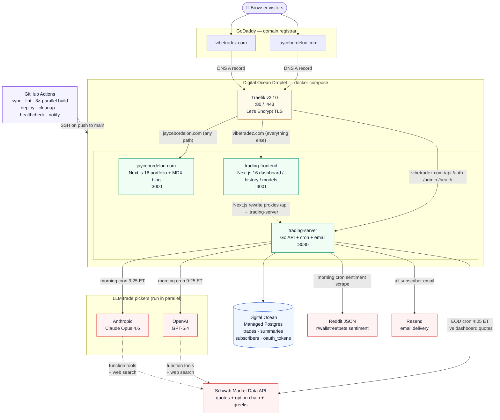

# personal-monorepo

Jayce Bordelon's production monorepo. Two public services and the infrastructure that runs them, all deployed to a single Digital Ocean droplet behind Traefik.

## Architecture



**Reading the diagram:** users hit GoDaddy DNS, which points at the droplet. Traefik terminates TLS (Let's Encrypt) and routes by hostname + path priority to one of three containers: the personal portfolio, the trading dashboard, or the trading API. Only the trading API talks to the outside world for trade picking — Postgres for persistence, Schwab for market data, OpenAI **and** Anthropic in parallel for the dual-model picker, Reddit for sentiment, Resend for email. GitHub Actions deploys by SSH'ing into the droplet and running `docker compose` against the same `docker-compose.yml` that defines the stack you see above.

## What's in here

```
personal-monorepo/
├── jaycebordelon.com/   Personal portfolio + blog (Next.js 16, MDX, Framer Motion)
├── vibetradez.com/      Options trading service
│   ├── server/          Go API (cron jobs, dual-model LLM picking, Schwab market data, Resend email)
│   ├── client/          Next.js 16 dashboard (live picks, history, model comparison)
│   └── local/           Self-contained Docker stack with seeded Postgres for offline dev
├── .github/workflows/   CI/CD pipeline (sync → lint → 3× parallel build → deploy → cleanup → healthcheck → notify)
├── docker-compose.yml   Production stack: Traefik + portfolio + trading server + trading frontend
└── CLAUDE.md            Project conventions, dev rules, and the dual-model architecture in detail
```

## Two services, one host

| Hostname | Container | Port | Routes |
|---|---|---|---|
| `jaycebordelon.com` / `www.jaycebordelon.com` | `jaycebordelon-com` | 3000 | All paths (Next.js portfolio) |
| `vibetradez.com` / `www.vibetradez.com` | `trading-server` | 8080 | `/api/*`, `/auth/*`, `/admin/*`, `/health` (priority 20) |
| `vibetradez.com` / `www.vibetradez.com` | `trading-frontend` | 3001 | Everything else (priority 10, Next.js trading UI) |
| `jayceb.com` / `www.jayceb.com` | — | — | 301 redirect to `jaycebordelon.com` |

Traefik handles TLS (Let's Encrypt) and routes by hostname + path priority. The legacy `jayceb.com` portfolio domain is kept around as a permanent redirect so existing links don't break.

## Trading service highlights

- **Dual-model independent picking.** Every weekday morning the Go cron sends the same `AnalysisPrompt` to both OpenAI GPT-5.4 (via `openai-go/v3`) **and** Anthropic Claude Opus 4.6 (via `anthropic-sdk-go`) in parallel. Each model independently runs the full workflow with the same Schwab market data toolset and built-in web search, and each produces its own ranked top 10 picks. Neither model sees the other's output. The cron then unions both pick sets — consensus picks (where both models picked the same ticker) carry both scores and rationales and tie-break ahead of single-model picks.
- **Global model filter.** A segmented `All / OpenAI / Claude` control rendered in the nav bar applies globally across the dashboard, the history page, and every API call. Backed by a React context that persists to localStorage.
- **`/models` head-to-head page.** Side-by-side OpenAI vs Anthropic backtest with cumulative P&L curve, agreement rate (how often the two models scored within 1 of each other), best/worst pick per model, and a configurable date range. Backed by `GET /api/model-comparison?range=...`.
- **Configurable models.** `OPENAI_MODEL` and `ANTHROPIC_MODEL` env vars override the defaults baked into `vibetradez.com/server/internal/config/config.go` (`DefaultOpenAIModel`, `DefaultAnthropicModel`). The defaults must be refreshed from the official SDK docs whenever this code is touched — see CLAUDE.md "Model version refresh policy".
- **Live Schwab data.** Authorized via OAuth at `/auth/schwab`; tokens auto-refresh and persist to the `oauth_tokens` table. Quote and option-chain calls feed both the cron pickers and the live dashboard.
- **Email delivery.** Resend handles morning picks, EOD summaries, weekly reports, and admin announcements. Subscribers stored in Postgres; HTML templates in `vibetradez.com/server/internal/templates/`.
- **Granular `/health`.** One endpoint reports per-service status (database, openai, anthropic, schwab, api) using the actual SDK clients, with latencies. The deployment healthcheck job auto-gates on every service in the response without needing YAML changes per addition.

## Running locally

The trading service has a self-contained Docker stack that boots Postgres + the Go server + the Next.js frontend with realistic seeded data. No production credentials, no external API calls, no Traefik.

```bash
cd vibetradez.com/local
docker compose -f docker-compose.local.yml up --build
```

Then open <http://localhost:3001>. Stub keys are baked into the compose file so the server starts without making real OpenAI / Anthropic / Schwab / Resend calls; the cron jobs are pushed to Sunday so they never fire. The seed data includes ~10 trading days of dual-scored union picks (OpenAI-only, Claude-only, and consensus) with EOD summaries, so the dashboard, history page, and `/models` comparison all render with content. See `vibetradez.com/local/README.md` for the full reference.

The portfolio site is just a Next.js app:

```bash
cd jaycebordelon.com
npm run dev
```

## CI / CD

`main` is the deploy branch. Pushing to `main` triggers `.github/workflows/main-pipeline.yml`, which SSHes into the production droplet and runs:

1. **sync** — `git reset --hard origin/main`
2. **lint** — Biome (TS) + gofmt + golangci-lint (Go)
3. **build** — three independent parallel jobs, one per service: `build_portfolio`, `build_frontend`, `build_server`. Each one runs `docker compose build --no-cache <service>` for exactly its target. The deploy step needs all three to succeed; there is no partial deploy.
4. **deploy** — `docker rollout` for the web apps (zero-downtime), `docker compose up -d --force-recreate` for the trading server, and `docker compose up -d traefik` to guarantee the reverse proxy is running before the pipeline marks itself green.
5. **cleanup** — `docker system prune -af` (no `--volumes`, so Traefik's Let's Encrypt cert volume is preserved) plus a per-image trim loop that keeps only the three most recent tagged builds per service.
6. **healthcheck** — endpoint checks (`vibetradez.com`, `vibetradez.com/history`, `vibetradez.com/models`, `jaycebordelon.com`) plus granular `/health` parsing that fails on any non-ok service.
7. **notify** — email with the pipeline result and per-service build status.

Per the project rules in `CLAUDE.md`: never push directly to `main`, always work on feature branches, and let the human merge.

## Where to look next

- `CLAUDE.md` — full project conventions, env var reference, dual-model details, common operations, and the model version refresh policy
- `vibetradez.com/local/README.md` — running the local Docker stack and inspecting the seeded data
- `docker-compose.yml` — production Traefik routing and TLS configuration
- `.github/workflows/` — CI/CD pipeline definitions
