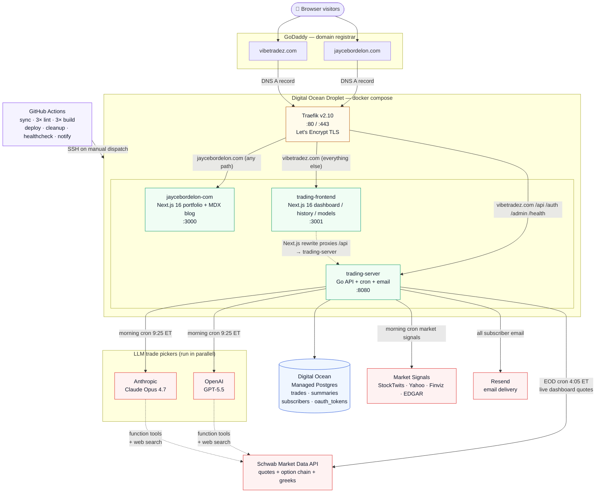
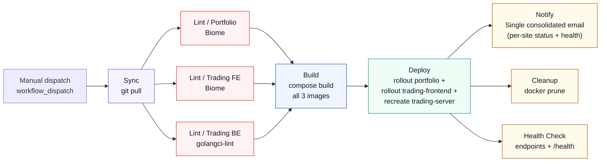

# jaycestuff

Jayce Bordelon's production monorepo. Two public services and the infrastructure that runs them, all deployed to a single Digital Ocean droplet behind Traefik.

## Architecture



**Reading the diagram:** users hit GoDaddy DNS, which points at the droplet. Traefik terminates TLS (Let's Encrypt) and routes by hostname + path priority to one of three containers: the personal portfolio, the trading dashboard, or the trading API. Only the trading API talks to the outside world for trade picking: Postgres for persistence, Schwab for market data, OpenAI **and** Anthropic in parallel for the dual-model picker, four market signal sources (StockTwits, Yahoo Finance, Finviz, SEC EDGAR) for trending tickers and catalysts, and Resend for email. GitHub Actions deploys by SSH'ing into the droplet and running `docker compose` against the same `docker-compose.yml` that defines the stack you see above.

## What's in here

```
jaycestuff/
├── jaycebordelon.com/   Personal portfolio + blog (Next.js 16, MDX, Framer Motion)
├── vibetradez.com/      Options trading service
│   ├── server/          Go API (cron jobs, dual-model LLM picking, Schwab market data, Resend email)
│   ├── client/          Next.js 16 dashboard (live picks, history, model comparison)
│   └── local/           Self-contained Docker stack with seeded Postgres for offline dev
├── .github/workflows/   CI/CD pipeline (sync → 3× lint → 3× build → deploy → cleanup → healthcheck → notify)
├── docker-compose.yml   Production stack: Traefik + portfolio + trading server + trading frontend
└── CLAUDE.md            Project conventions, dev rules, and the dual-model architecture in detail
```

## Two services, one host

| Hostname | Container | Port | Routes |
|---|---|---|---|
| `jaycebordelon.com` / `www.jaycebordelon.com` | `jaycebordelon-com` | 3000 | All paths (Next.js portfolio) |
| `vibetradez.com` / `www.vibetradez.com` | `trading-server` | 8080 | `/api/*`, `/auth/*`, `/admin/*`, `/health` (priority 20) |
| `vibetradez.com` / `www.vibetradez.com` | `trading-frontend` | 3001 | Everything else (priority 10, Next.js trading UI) |
| `jayceb.com` / `www.jayceb.com` | — | — | 301 redirect to `jaycebordelon.com` |

Traefik handles TLS (Let's Encrypt) and routes by hostname + path priority. The legacy `jayceb.com` portfolio domain is kept around as a permanent redirect so existing links don't break.

## Trading service highlights

- **Dual-model independent picking.** Every weekday morning the Go cron sends the same `AnalysisPrompt` to both OpenAI GPT-5.5 (via `openai-go/v3`) **and** Anthropic Claude Opus 4.7 (via `anthropic-sdk-go`) in parallel. Each model independently runs the full workflow with the same Schwab market data toolset and built-in web search, and each produces its own ranked top 10 picks. Neither model sees the other's output. The cron then unions both pick sets — consensus picks (where both models picked the same ticker) carry both scores and rationales and tie-break ahead of single-model picks.
- **Global model filter.** A segmented `All / OpenAI / Claude` control rendered in the nav bar applies globally across the dashboard, the history page, and every API call. Backed by a React context that persists to localStorage.
- **`/models` head-to-head page.** Side-by-side OpenAI vs Anthropic backtest with cumulative P&L curve, agreement rate (how often the two models scored within 1 of each other), best/worst pick per model, and a configurable date range. Backed by `GET /api/model-comparison?range=...`.
- **Configurable models.** `OPENAI_MODEL` and `ANTHROPIC_MODEL` env vars override the defaults baked into `vibetradez.com/server/internal/config/config.go` (`DefaultOpenAIModel`, `DefaultAnthropicModel`). The defaults must be refreshed from the official SDK docs whenever this code is touched — see CLAUDE.md "Model version refresh policy".
- **Live Schwab data.** Authorized via OAuth at `/auth/schwab`; tokens auto-refresh and persist to the `oauth_tokens` table. Quote and option-chain calls feed both the cron pickers and the live dashboard.
- **Email delivery.** Resend handles morning picks, EOD summaries, weekly reports, and admin announcements. Subscribers stored in Postgres; HTML templates in `vibetradez.com/server/internal/templates/`.
- **Granular `/health`.** One endpoint reports per-service status (database, openai, anthropic, schwab, market_signals, api) using the actual SDK clients and live source probes, with latencies. The deployment healthcheck job auto-gates on every service in the response without needing YAML changes per addition.

## Running locally

The trading service has a self-contained Docker stack that boots Postgres + the Go server + the Next.js frontend with realistic seeded data. No production credentials, no external API calls, no Traefik.

```bash
cd vibetradez.com/local
docker compose -f docker-compose.local.yml up --build
```

Then open <http://localhost:3001>. Stub keys are baked into the compose file so the server starts without making real OpenAI / Anthropic / Schwab / Resend calls; the cron jobs are pushed to Sunday so they never fire. The seed data includes ~10 trading days of dual-scored union picks (OpenAI-only, Claude-only, and consensus) with EOD summaries, so the dashboard, history page, and `/models` comparison all render with content. See `vibetradez.com/local/README.md` for the full reference.

The portfolio site is just a Next.js app:

```bash
cd jaycebordelon.com
npm run dev
```

## CI / CD

`main` is the deploy branch, but deploys do not fire automatically. `.github/workflows/main-pipeline.yml` runs only on manual dispatch (GitHub Actions "Run workflow" button, or `gh workflow run main-pipeline.yml`), at which point it SSHes into the production droplet. Linting is still split per-project so one side can fail fast without affecting the other, but deploy is a single job that rolls out both sites with `continue-on-error` per side, and notification is a single consolidated email.



**Reading the diagram:** after `git pull` syncs the droplet, three independent lint jobs run in parallel. All three lints gate a single build step that rebuilds the three Docker images. The deploy job then runs both rollouts sequentially with `continue-on-error: true` on each SSH step, so a failure in one side does not block the other. Once deploy finishes (success, partial, or fail) a single email fires with per-site statuses, commit metadata, and the trading-server `/health` table. Cleanup and healthcheck run only when both sides deployed successfully.

1. **Sync** - `git reset --hard origin/main`
2. **Lint / Portfolio** - Biome check on `jaycebordelon.com/` (runs in parallel with other lints)
3. **Lint / Trading Frontend** - Biome check on `vibetradez.com/client/` (runs in parallel with other lints)
4. **Lint / Trading Server** - golangci-lint on `vibetradez.com/server/` (runs in parallel with other lints)
5. **Build** - Single `docker compose build --no-cache jaycebordelon-com trading-server trading-frontend` invocation, gated on all three lints passing
6. **Deploy** - One job with two `continue-on-error` SSH steps: (a) `docker rollout jaycebordelon-com`, (b) `docker rollout trading-frontend` + `docker compose up -d --force-recreate trading-server`. Overall step fails if either side failed, but both are attempted.
7. **Notify** - One consolidated email ("jaycestuff" slate theme) showing overall PASS/FAIL, per-site status, commit metadata, and live trading-server `/health` table. Always runs unless the workflow is cancelled.
8. **Cleanup** - `docker system prune -af` (no `--volumes`, so Traefik's Let's Encrypt cert volume is preserved). Runs only when deploy succeeded on both sides.
9. **Health Check** - endpoint checks plus granular `/health` parsing that fails on any non-ok service. Runs only when deploy succeeded on both sides.

Per the project rules in `CLAUDE.md`: never push directly to `main`, always work on feature branches, and let the human merge.

## Where to look next

- `CLAUDE.md` — full project conventions, env var reference, dual-model details, common operations, and the model version refresh policy
- `vibetradez.com/local/README.md` — running the local Docker stack and inspecting the seeded data
- `docker-compose.yml` — production Traefik routing and TLS configuration
- `.github/workflows/` — CI/CD pipeline definitions
